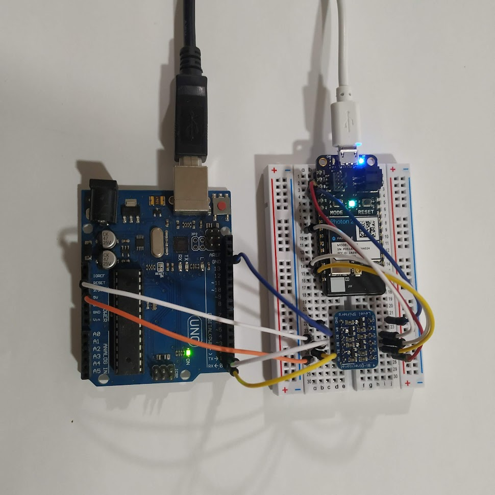
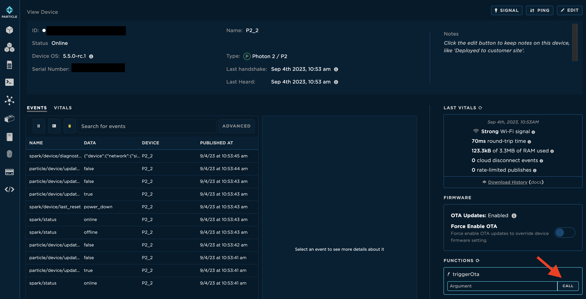
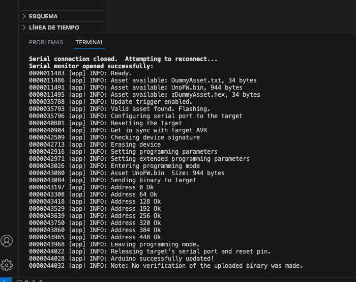

# UnoAssetOta

Sample program for uploading a sketch binary through serial to an Arduino UNO target using Particle Asset OTA function. The target Arduino must have the official Arduino bootloader preinstalled. Arduino bootloader uses the STK500 protocol so maybe other similar bootloaders could work. Only tested on Arduino UNO, it needs lots of changes in order to work on other devices.

This program exposes a triggerOta() custom function on the particle console for the user so the asset update can be triggered on request by the user.

### Disclaimer:

- This is still a work in progress!
- Only tested on Arduino UNO (ATMega328p) with the official Arduino bootloader as target.
- Only tested on Photon 2 as host.
- Only tested using Adafruit's 4-CH BSS138 bidirectional level shifter (PN 757).

## Hardware

* Host:   [Photon 2](https://store.particle.io/products/photon-2)
* Target: [Arduino UNO](https://store.arduino.cc/products/arduino-uno-rev3) (or detached ATMega328P with arduino bootloader)
* Level shifter: Adafruit 4-CH BSS138 level shifter [PN #757](https://www.adafruit.com/product/757)

## Notes PLEASE READ!

- ***Photon 2 IOs are rated at 3.3V, connecting the Photon DIRECTLY to the arduino output WILL KILL your Photon 2 IOs!***
- Always connect your Arduino and your photon using level shifters (more info in the references section)
- ATMega328p's bootloader accepts serial frames at 115200 baud, 8 bits, No parity, 1 stop bits.
- For bulk binary uploads, the bootloader accepts blocks of 128 bytes or less.
- No verification of the uploaded code is done in this example.

## Wiring table

| Photon 2 | Level Shifter | Uno (ATMega328p) |
| ---------- | --------------- | ------------------ |
| 3V3      | LV            | -                |
| -        | HV            | 5V               |
| GND      | GND (LV side) | -                |
| -        | GND (HV side) | GND              |
| TX1 (D8) | A1            | -                |
| -        | B1            | RX (D0)          |
| RX1 (D9) | A2            | -                |
| -        | B2            | TX (D1)          |
| D19      | A3            | -                |
| -        | B3            | RST              |



## How it works: Asset OTA

Any file stored in the assets/ folder included in this project will be compressed and sent along the photon's firmware flashing using the Particle Workbench, the Particle CLI, and even fleet-wide OTA update for a product.

At startup, the user application on the Photon 2 will not run until all the assets are downloaded. From that, the user application can manage and pass the files to the attached peripheral devices.

The read, write, and verification functions to the peripherals must be programmed by the user since they are protocol/hardware-specific.

## Preparing the arduino sketches

You need to add the pre-compiled Arduino sketch to this project before compiling the Photon firmware. Arduino compiles its sketches in IntelHex32 format with the extension .hex but you need to convert that file into raw binary format before putting it in the assets folder. You could write a function on the photon to manage the .hex directly but for this example is easier to demonstrate using a simpler format.

### Instructions:

1. On the arduino IDE:
   * Write and compile the sketch to be loaded to the target.
   * Go to Sketch -> Export compiled binary. The IDE will create a folder inside the project folder with the copiled binaries.
   * Look for the file with extension`.ino.hex` (without bootloader). Don't use any files containing`.ino.with_bootloader`.
2. Convert the .hex file to binary raw data.
   * On Windows you can use [WinHex](http://www.winhex.com/winhex/hex-editor.html).
     * Load the .hex file.
     * Go to Edit -> Convert file.
     * Select Intel Hex to binary, click "Ok".
     * Click "No" when asked to round up file size.
     * File -> Save As, write a name making sure to add the .bin extension.
   * On Mac and Unix systems you can use [hex2bin](https://github.com/Keidan/hex2bin/blob/master/README.md)
     * `$ hex2bin program.ino.hex`
     * You will obtain a .bin file with the same name.

### Example sketch

The binary preloaded in this project was obtained by compiling the following sketch on Arduino IDE:

```
int ledPin = 13;
void setup()
{
   pinMode (ledPin, OUTPUT);
}
void loop()
{
   digitalWrite (ledPin, HIGH);
   delay (50);
   digitalWrite (ledPin, LOW);
   delay (1000);
}
```

## Preparig the bundle
At the time of writing this, the Asset OTA is still in beta and the commands on the Workbench CLI still don't take the bundles. But certainly this will change soon.

What worked for me:
- Having the particle CLI and the Workbench updated to the last version.
- Add the converted Arduino binary to the `/assets` folder in this project.
- Make sure the line `assetOtaDir=assets` is included in the file `project.properties` in this project.
- Compile using the Workbench command `>particle: compile application (local)` and check the compile output to see where the bundle was saved. You´ll see something like `Saved bundle to: target/5.5.0-rc.1/p2/UnoAssetOta.zip`
- Open a terminal (can also be the vs code terminal) and run `particle flash --local target/5.5.0-rc.1/p2/UnoAssetOta.zip`

## Using this example code

Just go to your particle console and look for your device. Under the functions section, you will see one called triggerOTA. Press the call button and your photon will do the rest. 



If you want to see what's happening, open your serial monitor before calling the function to see the output logs.



## ToDo:

- Check why is needed to change 0xFC with 0x10 when reading from device. I have no idea why.
- Check why the address counter needs to increment in 64 and not in 128. I have no idea why but it works!
- Add wiring examples for voltage divider and level shifters

## References:

- DeviceOS API reference - [Asset OTA](https://docs.particle.io/reference/device-os/firmware/#asset-ota)
- Developer tools - [Compiling a directory with assets](https://docs.particle.io/reference/developer-tools/cli/#compiling-a-directory-with-assets)
- Cloud - [OTA firmware updates](https://docs.particle.io/getting-started/cloud/ota-updates/#asset-ota)
- Github Asset OTA [STM32 and LCD image examples](https://github.com/particle-iot/asset-ota-examples)
- Updating an Arduino Uno via serial. The main body of the code in this example comes from [here](https://forum.arduino.cc/t/put-an-arduino-uno-in-programming-mode/334383/23)
- STK 500 [protocol docs](https://www.microchip.com/content/dam/mchp/documents/OTH/ApplicationNotes/ApplicationNotes/doc2525.pdf)
- STK500 [example implementation](https://www.diericx.net/post/upload-hex-file-from-csharp/) on C#. Descriptions are very helpful.
- How to use level shifters [video](https://youtu.be/rawUx0WYpDA)
- Understanding [IntelHex32 format](http://www.elproducts.com/understanding-hex-files.html)